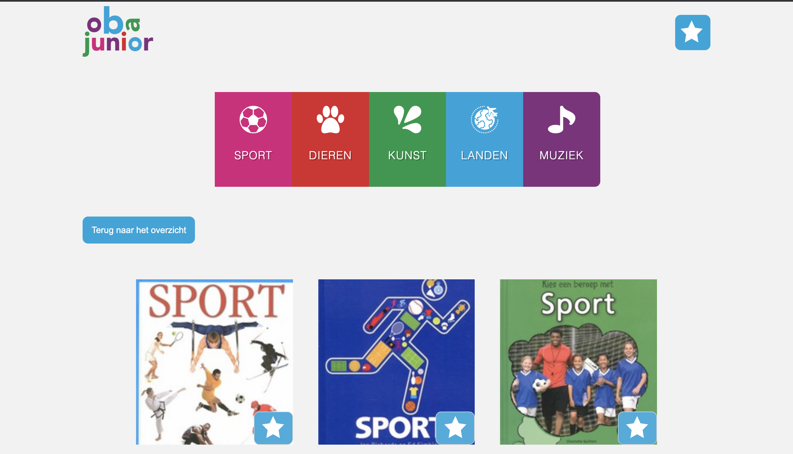
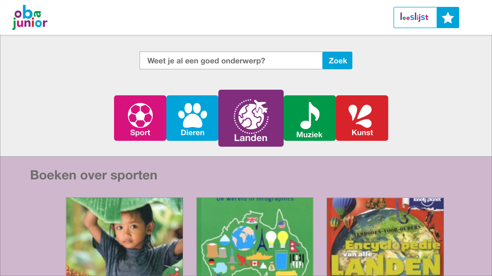
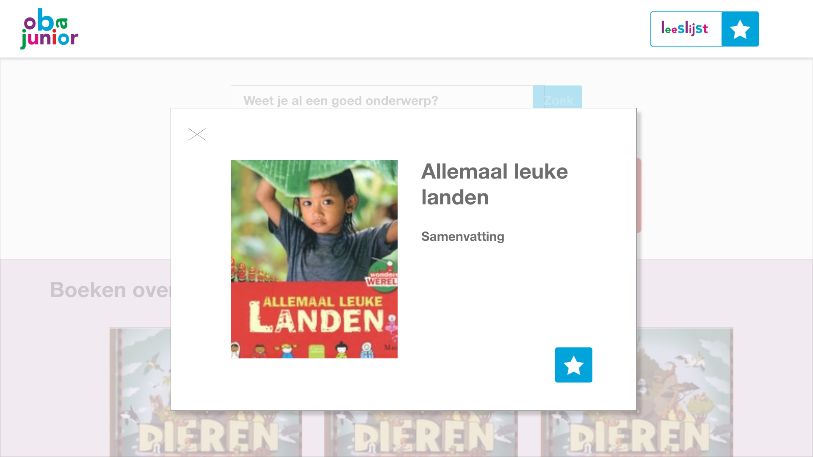
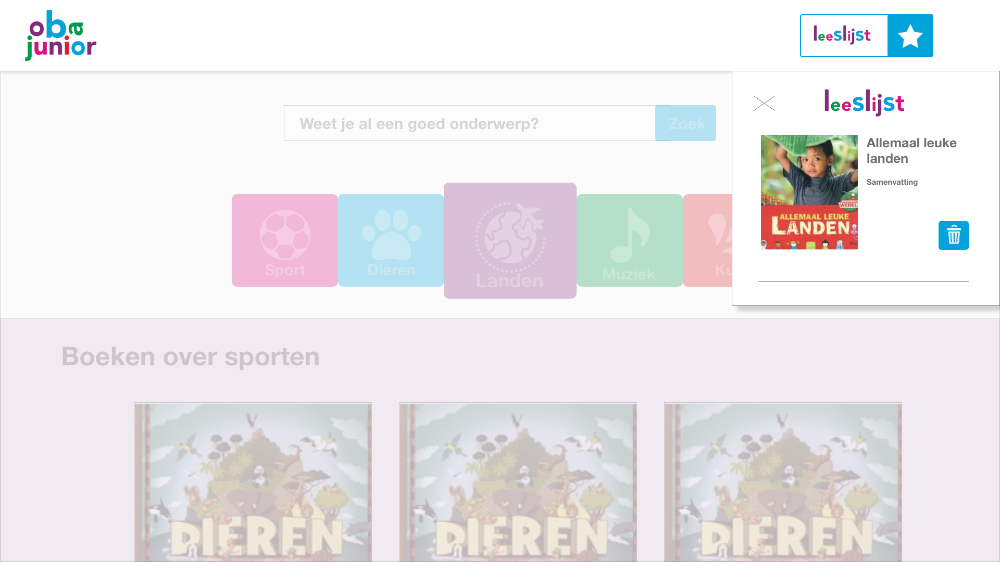
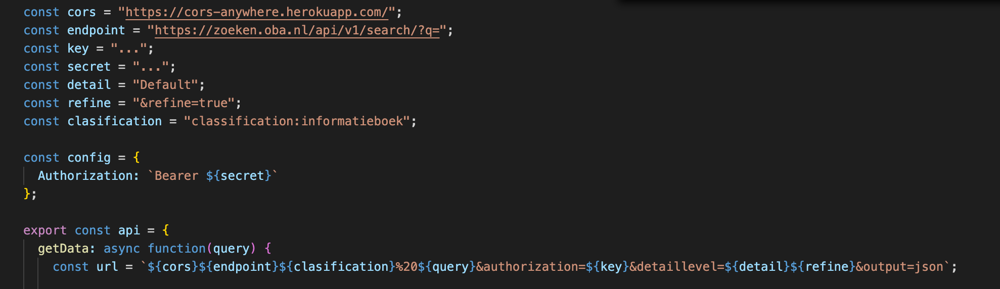
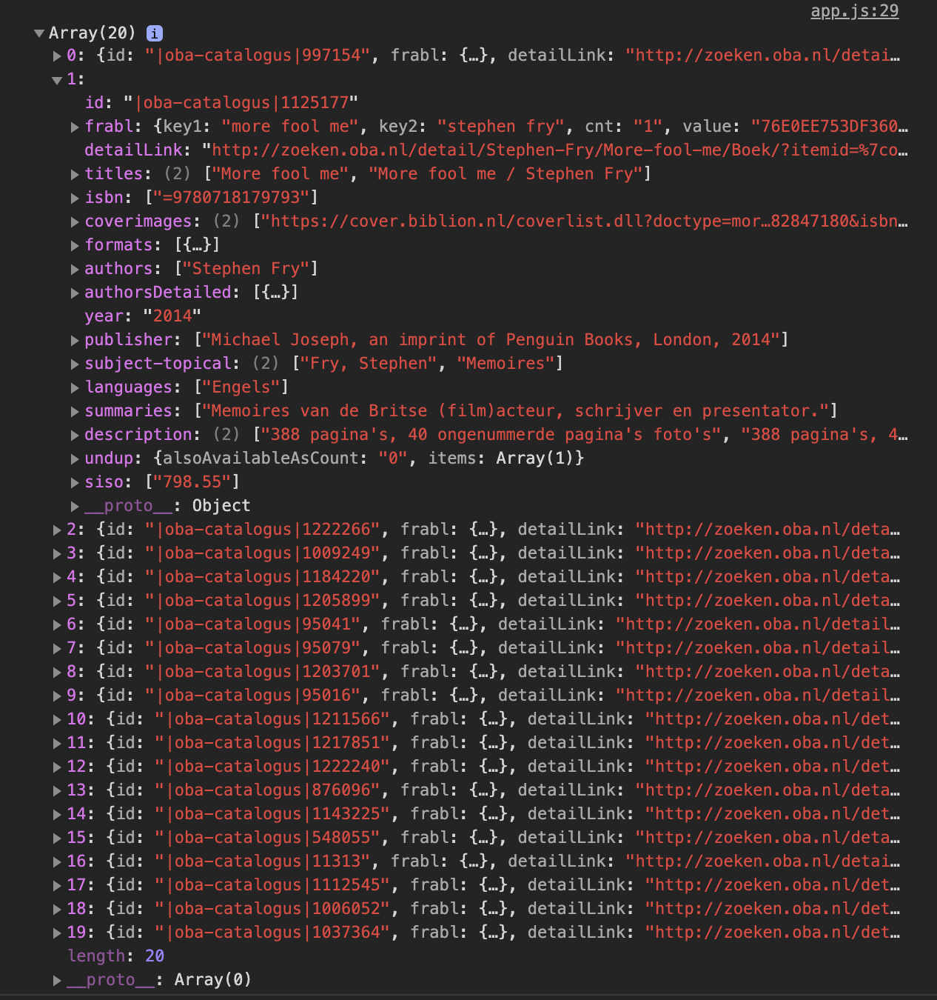

# Werkstukopedia

## Project @cmda-minor-web 1819



## Inhoudspagina

- [Live Demo](#Live-Demo)
- [Beschrijving](#Beschrijving)
- [Gebruik](#Gebruiks)
- [API](#API)
- [Punten voor in de toekomst](#Punten-voor-in-de-toekomst)
- [Bronnen](#Bronnen)

## Live Demo

[Live Demo](https://zeijls.github.io/project-1-1920/.)

## Opdracht

In deze projectweek kregen wij 3 cases waar we uit konden kiezen. Ik heb voor de 2e case gekozen waarbij je een functie ontwikkelen die NT2 kinderen helpt met het vinden van de goede boeken voor een werkstuk dat zij moeten maken. In eerst instantie had ik deze gekozen omdat ik nog graag extra aan de slag wilde met map reduce en filter, en deze case mij daar het meest geschrikt voor leek.

## Concept

In mijn concept kun je een goed onderwerp voor je werkstuk vinden. Ik heb alles zo duidelijk mogelijk proberen te onderscheiden, zoals bijvoorbeeld met kleuren. Het kind kan filteren op verschillende niveaus. Zodra het kind op een boek klikt kan hij of zij lezen waar het over gaat en worden er verschillenden details weergegeven. Als het kind het een interessant boek lijkt voor haar werkstuk kan ze hem toevoegen aan haar leeslijst. Zodra ze in de bibliotheek is pakt ze haar leeslijst erbij en kan ze in een keer alle boeken verzamelen.

Dit zijn de schetsen van hoe ik het eruit wil laten zien;





## Gebruik

Ga via de terminal naar de folder waar je het projet wilt plaatsen:

```
cd Pth/To/Folder
```

Clone de repository

```
    git clone https://zeijls.github.io/project-1-1920/.git
    cd project-1-1920
```

Na het clonen, open het `index.html` bestand in je localhost.

## API

De API die ik hier heb gebruikt is van de OBA. Hierin staan al hun verschillende boeken. Om de API te gebruiken heb je een key nodig.

- [OBA API](https://zoeken.oba.nl/api/v1/?i_public=9a9b148ab8abe117aa908&i_secret=1a3b58ea286b7117a29af#/details)

#### Data ophalen uit de API

Om de boeken van te voren te filteren gebruikt de API verschilende endpoinst. Hiervoor heb ik de volgende url gebruikt;


Ik heb de keys niet weergegeven omdat het niet de bedoeling is dat dit openbaar wordt.

Vervolgens moet je je fetch de volgende parameteres meegeven: confic, url
`fetch(url, config)`

Als dit is gedaan wordt de volgende data weergegeven:


## Punten voor in de toekomst

- [ ] Detail pagina
- [ ] Zoeken op onderwerpen
- [ ] 3D Caroussel om de onderwerpen weer te geven
- [ ] Werkende wishlist
- [ ] Bekijken of de boeken in de wishlist nog beschikbaar zijn in de bilbiotheek
- [ ] Spraak output functie zodra het kind het woord niet kent
- [ ] De achtergrond kleur laten staan bij de categorie
- [ ] Sidebar voor leeslijst

## Bronnen

- [De repository Project 1](https://github.com/cmda-minor-web/project-1-1920)
- [Change background on hover](https://codepen.io/ianfarb/pen/DegqJ)

## Credits

- Marjolein Aardewijn, heeft me geholpen met de local storage, het verwijderen van de oude boeken en async functies.
- Joost Faber, zijn voorbeeld in de repository
